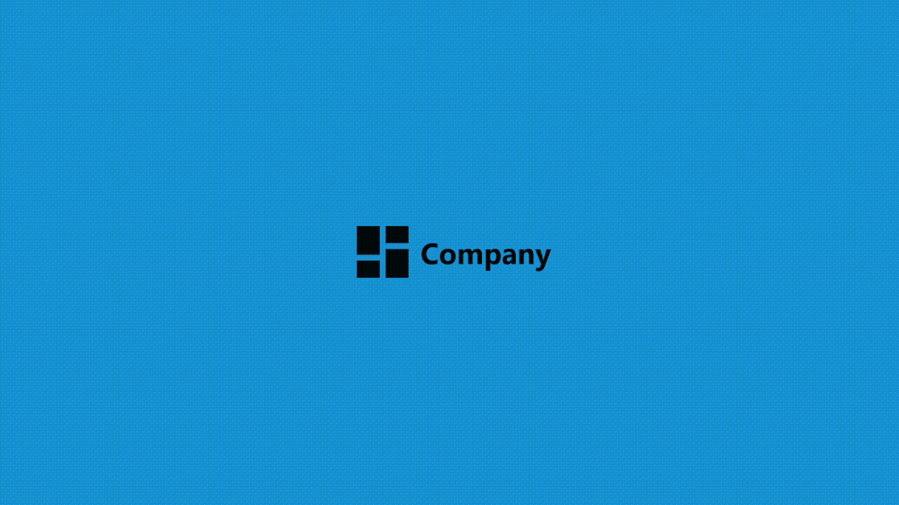

# Project: Login Page | The Odin Project

O objetivo deste projeto foi desenvolver a interface de uma página de início de sessão utilizando HTML e CSS, com especial foco na criação de um layout moderno, responsivo e visualmente apelativo, bem como na utilização de animações.

Este projeto faz parte do percurso Full Stack JavaScript do The Odin Project e teve como principal objetivo consolidar os conhecimentos adquiridos em HTML e CSS, através da criação de uma página de início de sessão adaptável a diferentes tamanhos de ecrã.

Além disso, este projeto permitiu-me aprofundar e aplicar conceitos como Media Queries, clamp(), Container Queries, animações e transições, conhecimentos que pretendo continuar a aplicar em futuros projetos de frontend e full stack.

## Podes visualizar o projeto aqui:
https://rafaelribeiro2003.github.io/Project-Login-Page-theodinproject/

## Screenshot:

## Créditos: 
Este projeto foi desenvolvido como parte do currículo do **The Odin Project**.

---
## 🇬🇧 English

The goal of this project was to develop the interface of a login page using HTML and CSS, with a strong focus on creating a modern, responsive, and visually appealing layout, as well as implementing animations.

This project is part of The Odin Project's Full Stack JavaScript curriculum. Its main objective was to consolidate the knowledge acquired in HTML and CSS by building a login page that adapts to different screen sizes.

In addition, this project allowed me to deepen my understanding and apply concepts such as Media Queries, clamp(), Container Queries, animations, and transitions, which I plan to continue applying in future front-end and full-stack projects.

## Live Demo
https://rafaelribeiro2003.github.io/Project-Login-Page-theodinproject/

## Screenshot

## Credits
This project was completed as part of **The Odin Project** curriculum.
